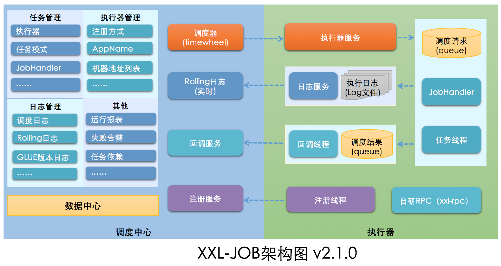

# 项目启动&主流程调试

直接看官网就行，主要是改些配置。

## 配置修改并启动

+ **MySQL**

  IP、端口、密码。

+ **日志输出目录**

  这里将日志放源码目录了。

  ```properties
  # xxl-job-executor-sample-springboot application.properties
  xxl.job.executor.logpath=/home/lee/mywork/java/github/xxl-job/logs/jobhandler
  # xxl-job-executor-sample-springboot logback.xml
  <property name="log.path" value="/home/lee/mywork/java/github/xxl-job/logs/xxl-job-executor-sample-springboot.log"/>
  # xxl-job-admin XxlJobFileAppender.java
  private static String logBasePath = "/home/lee/mywork/java/github/xxl-job/logs/jobhandler";
  # xxl-job-admin logback.xml
  <property name="log.path" value="/home/lee/mywork/java/github/xxl-job/logs/xxl-job-admin.log"/>
  ```

+ **Docker启动**

  ```shell script
  docker pull xuxueli/xxl-job-admin:2.4.0
  # 本地单节点启动，配置使用本地网络，修改端口以及数据库连接配置
  docker run -e PARAMS="--spring.datasource.url=jdbc:mysql://127.0.0.1:3306/xxl_job?useUnicode=true&characterEncoding=UTF-8&autoReconnect=true&serverTimezone=Asia/Shanghai --spring.datasource.username=root --spring.datasource.password=123456 --server.port=58081" -v /tmp:/data/applogs --name xxl-job-admin --network=host -d xuxueli/xxl-job-admin:2.4.0
  ```

## 开启WireShark

为了方便查看各服务节点之间以及与前端的交互数据打开抓包。

**捕获过滤器**

```tex
port 8080 or port 8081 or port 9999
```

**显示过滤器**（聚焦某个功能时用）

```
//比如
http.request.uri contains "/xxl-job-admin"
```

## 调试功能



xxl-job-admin 对应调度中心；

xxl-job-executor-sample-springboot 对应执行器（业务服务）。

任务管理后台：http://localhost:8080/xxl-job-admin，帐号：admin/123456。

### 新建任务

抓包可以看到请求了 `/xxl-job-admin/jobinfo/add` 和 `/xxl-job-admin/jobinfo/add/pageList`。

```java
jobInfo = {XxlJobInfo@10145} 
 id = 0
 jobGroup = 1				//默认分组
 jobDesc = "Third"
 addTime = null
 updateTime = null
 author = "LXH"
 alarmEmail = ""
 scheduleType = "CRON"		//计划任务配置类型：当前有三种：NONE、CRON、FIX_RATE
 scheduleConf = "0/30 * * * * ?"
 misfireStrategy = "DO_NOTHING"
 executorRouteStrategy = "FIRST"	//路由策略（分布式节点）
 executorHandler = "demoJobHandler"
 executorParam = ""
 executorBlockStrategy = "SERIAL_EXECUTION"	//阻塞策略
 executorTimeout = 0
 executorFailRetryCount = 0
 glueType = "BEAN"			//任务运行模式：BEAN(结合 "JobHandler" 属性匹配执行器中任务)、GLUE
 glueSource = ""
 glueRemark = "GLUE代码初始化"
 glueUpdatetime = null
 childJobId = ""
 triggerStatus = 0
 triggerLastTime = 0
 triggerNextTime = 0
```

1）获取执行器分组；

2）检查计划任务配置，比如 CRON，就检查表达式语法；

3）检查运行模式相关配置；

4）检查路由策略、执行器线程池阻塞策略；

5）检查ChildJobId;

6）最后将任务插入到数据库 xxl-job-info 表。

### 触发执行

#### 手动触发一次

抓包可以看到请求了`/xxl-job-admin/jobinfo/trigger`。参数：

```java
HTML Form URL Encoded: application/x-www-form-urlencoded
    Form item: "id" = "6"	//任务ID
    Form item: "executorParam" = ""
    Form item: "addressList" = ""
```

调用 `JobTriggerPoolHelper.trigger(id, TriggerTypeEnum.MANUAL, -1, null, executorParam, addressList);`触发任务执行。

JobTriggerPoolHelper 中建了两个线程池，fastTriggerPool、slowTriggerPool，区别是最大线程数和无界阻塞队列的初始容量。

手动触发就是往线程池提交异步任务（优先是放到 fastTriggerPool，如果已经有这个任务就放到 slowTriggerPool）。

任务中执行：

```java
XxlJobTrigger.trigger(jobId, triggerType, failRetryCount, executorShardingParam, executorParam, addressList);
	processTrigger(group, jobInfo, finalFailRetryCount, triggerType, shardingParam[0], shardingParam[1]);
		runExecutor(triggerParam, address);
```

1）存一条执行日志到 xxl_job_log表 ；

2）初始化触发参数 TriggerParam；

3）读取当前选择的执行器分组中注册的执行器列表（执行器服务启动时注册），应用路由策略，从列表中选择一个执行器节点获取其远程地址；

4）触发远程执行器执行任务；

5）任务执行成功后记录触发信息到 xxl_job_log 表。

#### 执行器节点地址注册

执行器服务器启动时，创建了名为 XxlJobSpringExecutor 的Bean。


#### 自动触发

TaskThread。

